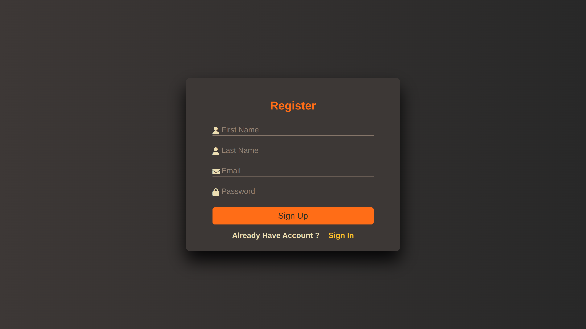
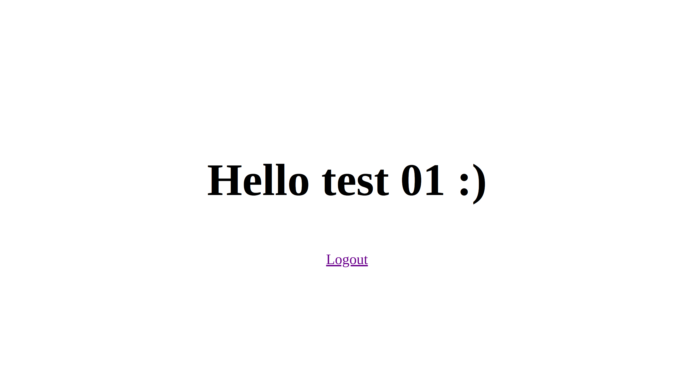
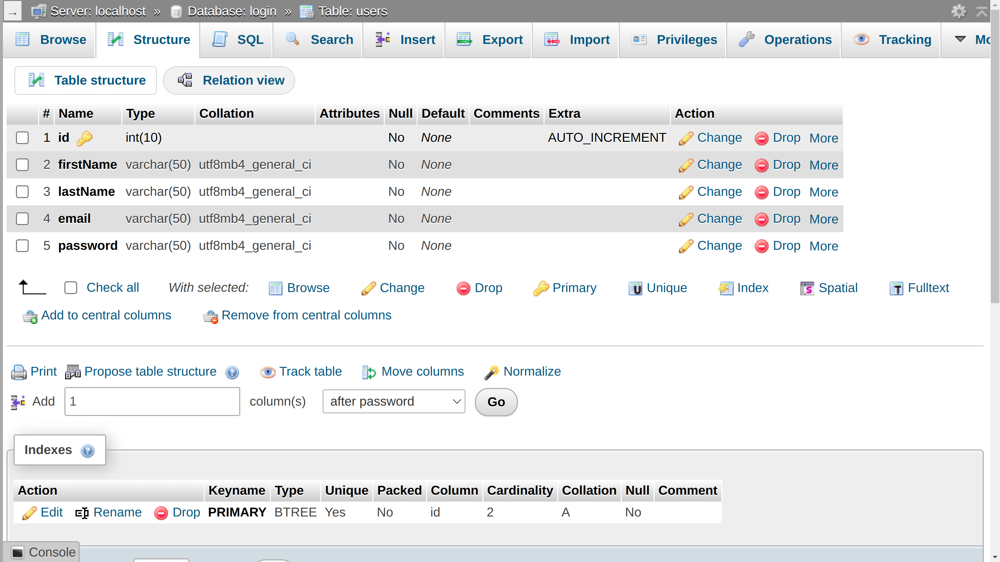
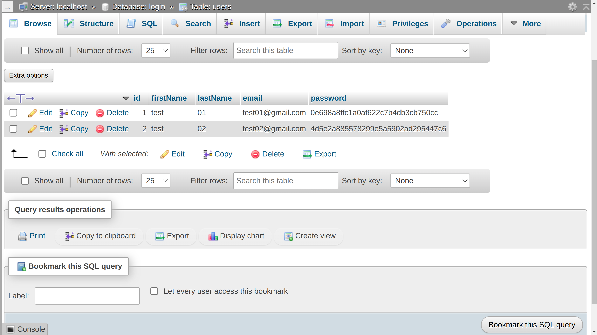

# Login Page with XAMPP

**Author**: Sourav Mondal  
**Student ID**: 11220321030  
**Section**: 5A

This is a simple Login & Register Web Form using PHP XAMPP.

## Project Overview

This project includes a login page where users can input their credentials to gain access to a website or application. The login information is processed by a PHP script, and if the credentials are correct, the user is redirected to the homepage. Otherwise, an error message is displayed.

## Technologies Used

- **HTML**: Structure of the login form
- **CSS**: Styling of the login page
- **PHP**: Backend scripting to process the login credentials
- **JavaScript**: switching between two forms — Sign Up and Sign In
- **XAMPP**: Local server environment to run PHP scripts

## Preview

Here is a preview of project:

### Sign-In and Registration Page

<table>
  <tr>
    <td></td>
    <td></td>
  </tr>
</table>

### Correct and Incorrect Credentials

<table>
  <tr>
    <td></td>
    <td></td>
  </tr>
</table>

### Database and Homepage

<table>
  <tr>
    <td></td>
    <td></td>
  </tr>
</table>

## Setup Instructions

Follow the steps below to set up and run this project on your local machine:

### 1. Install XAMPP
- Download and install [XAMPP](https://www.apachefriends.org/index.html) for your operating system.
- After installation, open the XAMPP control panel.

### 2. Start Apache and MySQL
- Start the **Apache** server and **MySQL** server from the XAMPP control panel.

### 3. Set up the Project Files
- Navigate to the XAMPP installation folder, typically located in `C:\xampp\htdocs` on Windows or `/opt/lampp/htdocs` on Linux.
- Open a terminal (Command Prompt on Windows or Terminal on Linux).
- Run the following Git command to clone this project into `htdocs`:

    ```bash
    git clone https://github.com/sourav739397/Login-Page-1030
    ```

### 4. Create a Database
- Go to [phpMyAdmin](https://localhost/phpmyadmin).
- Create a database named `login` ( whatever you want ) and select it.
    ```bash
    CREATE DATABASE login;
    USE login;
    ```
- Create a table named `users` with fields `id`, `firstName`, `lastName`,
`email` and `password`.
    ```bash
    CREATE TABLE users (
        Id INT(10) NOT NULL AUTO_INCREMENT,
        firstName VARCHAR(50) NOT NULL,
        lastName VARCHAR(50) NOT NULL,
        email VARCHAR(50) NOT NULL,
        password VARCHAR(50) NOT NULL,
        PRIMARY KEY (Id)
    );
    ```

### 5. Configure PHP Script
Make sure the PHP script for processing the login form is connected to your database. Update the database connection details in the PHP file (`connect.php`) if you changed name of database.

### 6. Access the Project
- Open a browser and navigate to http://localhost/Login-Page-1030 (replace `Login-Page-1030` with the name of your project folder).
- You should see the login page.

## Features

- **Login Form**: A simple form to enter a username and password.
- **Backend Authentication**: The PHP script processes the login request and checks the credentials.
- **Error Handling**: If incorrect credentials are entered, an error message is shown.

## Thanks and Credits

Special thanks to **Faria Afrin Tisha**, our DBMS course teacher, for her guidance and support in learning database management system.

## License

This project is licensed under the **MIT License**. You are free to use, modify, and distribute this project as long as you include the original license.  

---
> *This project was created as part of an academic assignment and serves as a demonstration of authentication functionality using PHP and XAMPP.*


